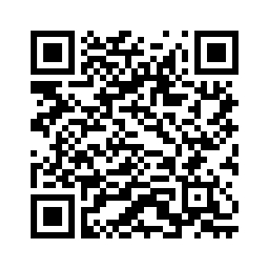

# DSi Calendar
**A calendar for the Nintendo DSi**
# Setup
1. install ndspkg: https://github.com/p1xelpp/ndspkg-host
2. connect ur DSi via ftpd on universal-db https://db.universal-team.net/ds/ftpd
3. if the default repo is not set up, the link is https://github.com/p1xelpp/ndspkg-host/raw/refs/heads/main/index.json
4. in ndspkg.py, run install dsicalendar (if its wrong just run lsp and search for it)
5. WAIT

or you can just scan this qr code i think:

